# cumulant-gan-pytorch
## PyTorch implementation of Cumulant GAN

This repository contains a PyTorch implementation of the Cumulant GAN model, as described in the original paper. The Cumulant GAN is an advanced Generative Adversarial Network designed to tackle a variety of challenges, including instability, mode collapse, and sample quality.

---

## This implementation includes three toy examples:

- Swiss roll dataset
- GMM8 Dataset
- TMM6 Dataset

---

## Results for Swiss roll dataset

  <table>
    <tr>
      <th>Wasserstein Distance</th>
      <th>KL Distance</th>
      <th>Reverse KL Distance</th>
      <th>Hellinger Distance</th>
    </tr>
    <tr>
      <td>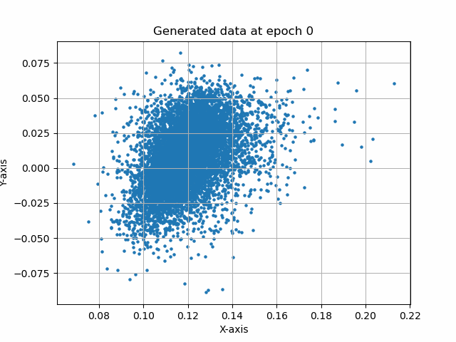</td>
      <td>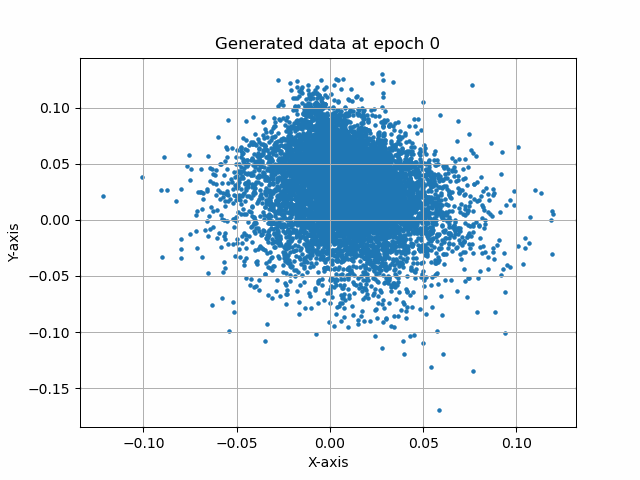</td>
      <td>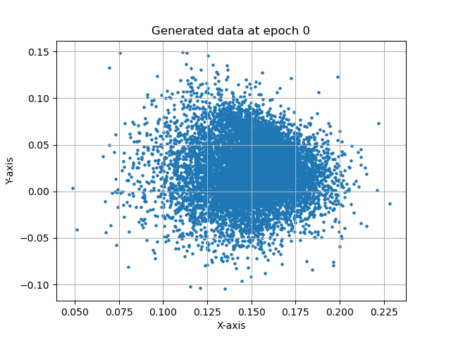</td>
      <td></td>
    </tr>
  </table>

---

## Results for GMM8 dataset

  <table>
    <tr>
      <th>Wasserstein Distance</th>
      <th>KL Distance</th>
      <th>Reverse KL Distance</th>
      <th>Hellinger Distance</th>
    </tr>
    <tr>
      <td>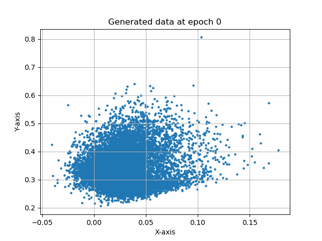</td>
      <td>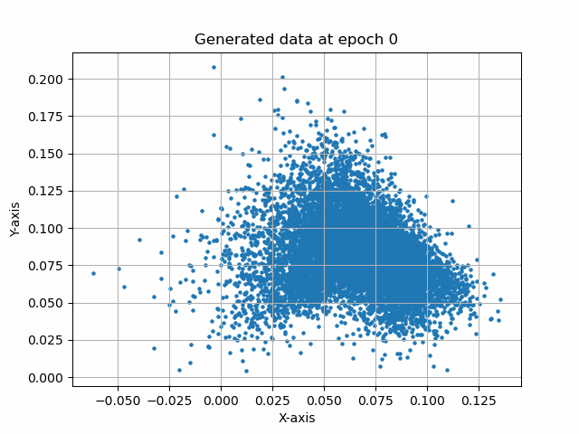</td>
      <td>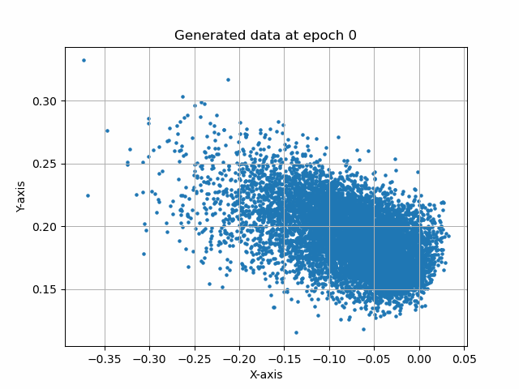</td>
      <td>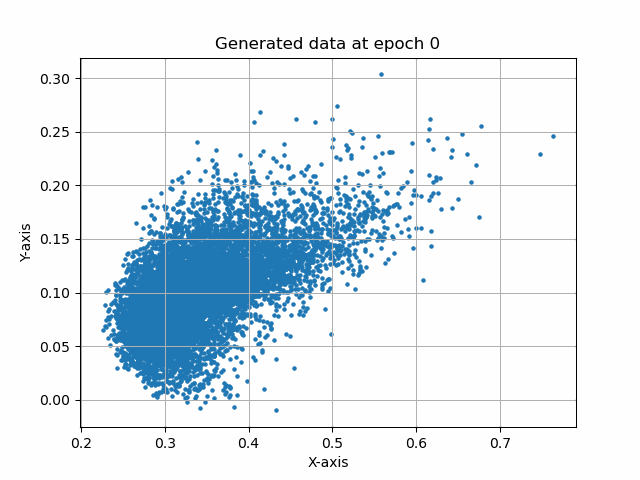</td>
    </tr>
  </table>

## Results for TMM6 dataset

  <table>
    <tr>
      <th>Wasserstein Distance</th>
      <th>KL Distance</th>
      <th>Reverse KL Distance</th>
      <th>Hellinger Distance</th>
    </tr>
    <tr>
      <td>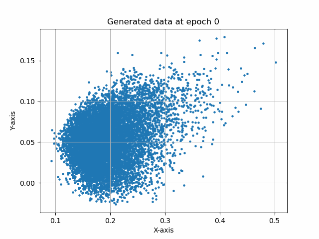</td>
      <td>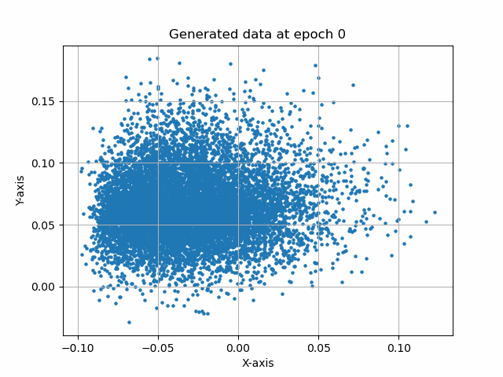</td>
      <td>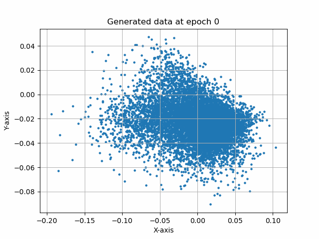</td>
      <td>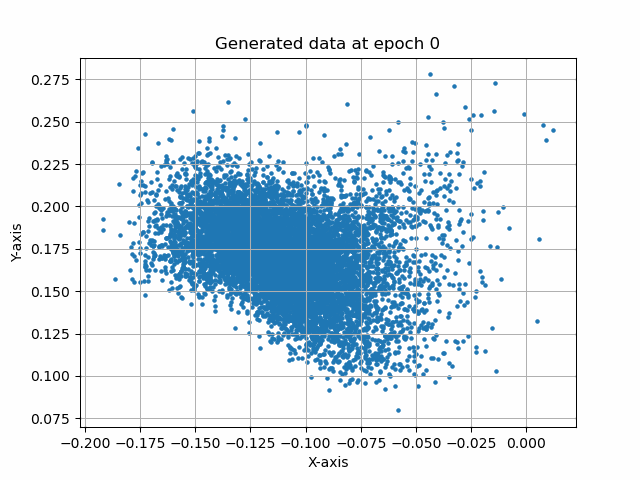</td>
    </tr>
  </table>

---

## Acknowledgments

- The paper can be found [here](https://arxiv.org/pdf/2006.06625.pdf).
- Dip's implementation in TensorFlow 2 (Dip is one of the authors) can be found [here](https://github.com/dipjyoti92/CumulantGAN/tree/main/).
- For a Tensorflow 2.x implementation (not by me), visit [this link](https://github.com/andrewkof/Cumulant-GAN).
