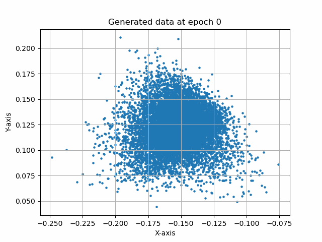

# cumulant-gan-pytorch
## PyTorch implementation of Cumulant GAN

This repository contains a PyTorch implementation of the Cumulant GAN model, as described in the original paper. The Cumulant GAN is an advanced Generative Adversarial Network designed to tackle a variety of challenges, including instability, mode collapse, and sample quality.

## This implementation includes three toy examples:

- GMM8 Dataset
- TMM6 Dataset
- Swiss roll dataset

## Results for Swiss roll dataset

1) Hellinger distance
- 

## Acknowledgments

- The paper can be found [here](https://arxiv.org/pdf/2006.06625.pdf).
- The first TensorFlow 1.x implementation is by Dip (one of the authors) and can be found [here](https://github.com/dipjyoti92/CumulantGAN/tree/main/).
- For a Tensorflow 2.x implementation (not by me), visit [this link](https://github.com/andrewkof/Cumulant-GAN).
